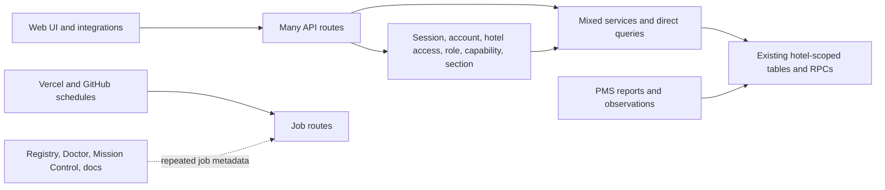
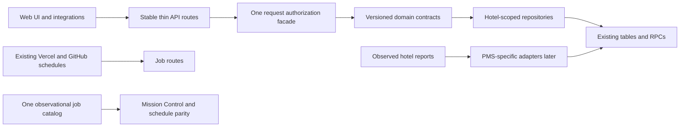

# Staxis architecture simplification proposal

## How Staxis works now

## Simpler proposed architecture

## Five highest-value simplifications

| Simplification | Benefit | Main danger | Safe order |
|---|---|---|---|
| 1. One authorization facade | Routes stop rebuilding the same session, hotel, role, capability, and section checks. | Widening hotel access, weakening MFA, or changing error order. | Compose current gates unchanged; prove one read route; migrate bounded route families; consider entitlement cutover only after production shadow evidence. |
| 2. PMS adapters based on real hotel reports | Supports differences between hotels without forcing one guessed format. | Building from assumptions, mixing hotels, or letting reported facts overwrite human-owned work. | Observe approved samples across normal cycles; document semantics and corrections; choose shared versus vendor adapters; replay in quarantine; canary one property. |
| 3. One hotel-day read contract | Consumers use one stable operating-day shape instead of joining the same projections differently. | Creating a competing source of truth or merging PMS facts with `room_work`. | Wrap existing property-scoped RPCs read-only; prove field parity; migrate one consumer at a time; add fields only when their source can state them truthfully. |
| 4. Thin routes around domain packages | Rules, data access, and orchestration become easier to locate and test. | A broad folder move can hide behavior changes and break callers. | Move pure rules first; then scoped repositories; then orchestration; keep compatibility exports; add import boundaries only after a domain pilot. |
| 5. One job catalog | Active, staged, manual, event-driven, and retired work is visible in one place; monitoring metadata stops drifting. | Documentation could accidentally activate, retire, or reschedule work. | Build an observational catalog; test it against current scheduler files; derive Mission Control and CI parity metadata; leave runtime schedules authoritative and unchanged. |

## What deliberately remains unchanged

- Hotel separation, authoritative property reach, roles, capabilities, MFA, RLS,
  public staff-link rules, and fail-closed behavior.
- Existing route URLs, response envelopes, schedules, production data, audit
  history, and database migration history.
- The ownership boundary between PMS-reported facts and Staxis-owned
  `room_work`; reports do not write human operational state.
- Retired PMS, SMS, voice, or CUA history until live-caller, retention, and
  rollback checks prove removal is safe.
- PMS parser design until real hotel workflows and approved report samples have
  been observed.
