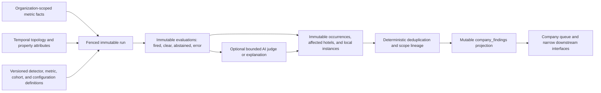

# Management-Company Finding Patterns

Status: implemented shadow candidate, pending migration review and production shadow validation. Migrations `0387` and `0390`, the deterministic evaluator, immutable persistence mapper, and the authenticated shadow runner are implemented on this branch. The route is deliberately absent from the production cron schedule and active projection is database-disabled. The legacy portfolio runner remains the production projection owner; its `/feed` boundary now fails closed on topology/source outages and reports bounded coverage explicitly, without adopting the v2 evidence architecture. This document distinguishes that safe v1 behavior from future cutover work; it does not claim literal mathematical perfection or production validation that has not happened.

## Scope and repository boundaries

This system finds reproducible patterns across hotels governed by one management company. Its architecture keeps the existing per-hotel detector engine authoritative and adds sister-hotel baselines, deterministic portfolio checks, explicit data-quality abstention, scope classification, and portfolio deduplication. The implemented shadow v1 does not yet import or mutate property-local finding rows; that bridge is an explicit cutover prerequisite described below. V1 makes zero AI calls; bounded AI remains only a future, separately enabled downstream option.

The current repository has the following relevant boundaries:

- `src/lib/findings/` is the per-hotel foundation: feeds, known checks, hotel-history baselines, missing-activity detection, materiality, silencing, persistence, and weekly discovery. That foundation remains authoritative for property-local findings. The shadow v1 records independently synthesized local manifestations with `local_finding_id = null`; it does not claim lineage to a property-local finding it did not load.
- `src/lib/company/portfolio-checks.ts` currently contains two pure portfolio detectors. They compare the whole company using raw supply spend or stopped activity. They are prototypes, not the completed cohort, normalization, or data-quality architecture described here.
- The current supply-spend feed has no comparison denominator or currency provenance, and an earliest event date is not proof of continuous coverage. Existing output must not be promoted to a normalized sister-hotel benchmark without new source contracts.
- `src/lib/company/portfolio-runner.ts` currently gathers hotel feeds and writes findings. Its page-load-triggered, generic-idempotency execution model is not the target production scheduler or concurrency model.
- `src/lib/company/company-findings.ts` and `public.company_findings` currently provide the company queue's lifecycle rows. In the target design, `company_findings` remains a mutable read/lifecycle projection; it is not the source of truth for runs, evidence, occurrences, cohort membership, or provenance.
- `src/lib/company/access.ts`, `src/lib/company/roles.ts`, `organization_property_relationships`, membership hats, and their RLS helpers remain the access-control foundation. Pattern evaluation additionally needs an explicit temporal topology interface; a query of relationships "right now" is insufficient for backfills.
- Company evidence tables currently deny browser roles, while privileged application queries supply the organization predicate. New evidence structures preserve deny-all browser access and add tenant-paired database constraints as defense in depth.
- `src/lib/company/vp-queue-server.ts` and the company queue are consumers of the projection. Today the queue bounds its hotel load to 30 while the portfolio runner can gather the full organization. The target system must not schedule from page loads or silently expose a different population from the one it evaluated.

Narrow interfaces may be added to read property-local findings, property metadata, metric facts, and organization topology, and to expose structured pattern outputs for downstream task routing or resolution tracking. This work does not redesign AI chat, notes, permissions, task queues, workflows, or reporting. It does not build the downstream routing or resolution systems.

The implemented downstream read boundary is deliberately narrower than a general evidence query. Its service-only RPC accepts an account-bound authorization-receipt ID, account ID, time, and fixed result cap—never an organization ID or property list. The database reasserts the live receipt and derives the exact organization/property scope inside the same statement. It exposes claims only from a finalized `active` run; a shadow run returns `shadow_only` with zero candidates, and stale, abstained, incomplete-scope, unauthorized, or otherwise non-claim states return bounded/redacted receipts rather than evidence. Active mode itself remains database-disabled pending the separately reviewed cutover.

Cross-company benchmarks are out of scope and prohibited. Network-wide ML priors, customer-network embeddings, cross-tenant aggregate distributions, and learned benchmark features are forbidden inputs, even if someone describes them as anonymized. A future network product would require a separate governance, consent, privacy, and architecture decision.

## Four scopes that must never be conflated

Every request and result carries four different concepts. They have different purposes and must be stored and tested independently.

| Concept | Meaning | Governing rule |
| --- | --- | --- |
| Access scope | The organizations and properties the caller is authorized to read or mutate. | Resolved from current authenticated memberships, hats, governing relationships, and the operation's role requirement. It is never inferred from a query or finding. |
| Query scope | The hotels the user explicitly asked about, such as one property, a region, or all hotels. | The engine must preserve it. An explicit all-hotels request may report exclusions, but normalization or cohorting must never silently narrow the query. |
| Evidence cohort | The comparable properties actually used to evaluate a metric for a subject or group. | Selected by a versioned, metric-specific cohort definition and data-quality gate. Membership and exclusions are part of the receipt. |
| Finding scope | What the evidence supports: `property_local`, `peer_cohort`, `group_region`, or `company_wide`. | Classified deterministically from the evidence, never copied from query scope, access scope, or the detector's display location. |

A fifth boundary, tenant scope, surrounds all four: every record and query belongs to exactly one organization. Access to several companies creates several isolated evaluations; it never creates a merged comparison population.

## Non-negotiable invariants

1. **One-company inputs.** A run has exactly one `organization_id`. Every source query, intermediate record, evidence row, occurrence, and projection mutation is constrained to it.
2. **Tenant-paired references.** A property, local finding, cohort membership, or other child reference cannot be attached using an unverified UUID or JSON alone. Database-enforced tenant-paired foreign keys or an equivalent organization-owned snapshot row must prove the relationship.
3. **Explicit authorization at every boundary.** Service-role code must require an organization scope and operation-specific role before querying. Browser roles remain deny-all on service-only evidence tables. Security-definer functions pin `search_path` and revoke browser execution.
4. **No cross-company comparison.** Data from another company, network aggregates, and network-wide ML priors are forbidden inputs. Multiple company hats require an explicit organization selection; they do not authorize unioning hotels.
5. **No missing-as-zero.** Zero is evidence only when the source proves a complete observation interval with value zero. Missing, late, failed, truncated, incompatible, or unverifiable input produces an exclusion or abstention.
6. **Raw facts survive normalization.** Every normalized value retains its raw numerator, denominator, units, currency, window, source/version, and transformation version.
7. **Comparable means compatible.** Values are compared only when their metric definition, unit semantics, denominator semantics, currency treatment, business window, and completeness meet the same versioned contract.
8. **Time is explicit.** `data_window`, `source_as_of`, `topology_as_of`, `evaluation_started_at`, and `recorded_at` are distinct. No historical run reads topology or cohort attributes through an implicit wall clock.
9. **Evidence is immutable.** Successful, clear, abstained, and failed evaluations are append-only. Corrections and backfills create revisions linked to what they supersede; they do not rewrite old receipts.
10. **Occurrences are immutable observations.** A manifestation of an issue in a run is append-only. Its affected hotels, local instances, scope, evidence, and version references cannot be changed later.
11. **Human decisions are separate from machine observations.** The projector may update machine state in `company_findings`, but it cannot overwrite a user's mute, known-problem, resolve, ownership, or resolution metadata.
12. **Deterministic core.** The same versioned facts, topology, definitions, and configuration produce the same eligibility, cohort, statistics, issue key, scope, and structured occurrence, independent of row order or worker identity.
13. **Explicit abstention.** Failing a cohort, denominator, compatibility, freshness, coverage, or stability gate is an observable result with reason codes. It is not an empty success and cannot expire an existing finding.
14. **Fenced writes.** Only the current lease generation may record or finalize a run or project its occurrences. Retry, overlap, takeover, and crash recovery cannot double-count or resurrect stale state.
15. **Bounded AI.** Deterministic and statistical gates run first. AI receives only already-authorized, structured candidate evidence, operates inside hard budgets, and cannot override isolation, data-quality, cohort, normalization, deduplication, or scope rules.
16. **Explainable output.** A finding receipt identifies exact hotels and local instances, inclusions and exclusions, dates, raw and normalized values, definitions and versions, quality decisions, issue key, scope derivation, and the reproducible source query or evidence reference.
17. **Finite numeric evidence.** Stored cohort weights, raw and normalized metrics, denominators, freshness/completeness measures, source values, materiality, confidence, magnitude, and escalation parameters reject PostgreSQL `NaN` and positive/negative infinity explicitly. JSON numeric-looking strings cannot bypass the same bounds enforced for ordinary numbers.

## Threat model

The system protects customer operational data, human decisions, finding history, and the credibility of management-company comparisons. It assumes application bugs, stale workers, malformed source data, incorrect hotel metadata, and authorized users attempting requests outside their role or company. It does not treat service-role possession, an organization ID from a client, or an AI-generated explanation as proof of authorization or truth.

Primary threats and required controls are:

- **Cross-tenant read or write:** a missing organization predicate, injected property ID, incorrectly paired local finding, multi-company user, or overly broad privileged function could mix customers. Use organization-scoped repositories, tenant-paired constraints, explicit organization selection, deny-all browser RLS, and negative integration tests with real PostgreSQL roles.
- **Access/query confusion:** a caller may be allowed to see only some properties while requesting all hotels, or may hold different roles at different companies. Resolve access before evaluation, reject or label inaccessible query members, and never use inaccessible hotels as hidden comparators.
- **Missingness presented as performance:** feed failure, row limits, onboarding gaps, partial days, or delayed ingestion can resemble low spend or stopped activity. Require source watermarks and completeness proof; otherwise exclude or abstain.
- **Unfair comparison:** size, service class, market, amenities, operating model, units, currency, seasonality, or denominator differences can create a convincing but invalid outlier. Cohort and normalization definitions are metric-specific, versioned, reviewed, and visible in evidence.
- **Temporal leakage:** current topology or metadata applied to a historical window can move evidence between organizations or cohorts. Snapshot valid-time topology and attributes at the declared `topology_as_of`.
- **Duplicate or conflicting evidence:** retries, duplicate source events, overlapping detectors, or corrections can stack cards or erase meaningful local differences. Use stable source IDs/hashes, deterministic issue keys, immutable occurrence links, and explicit conflict groups.
- **Concurrency corruption:** an expired lease holder, overlapping scheduler, projection retry, or concurrent user verdict can lose occurrences or reverse a decision. Use fencing generations, atomic inserts, optimistic projection versions, and separate machine/human fields.
- **AI leakage or authority inflation:** raw multi-hotel sweeps, untrusted text acting as instructions, or model confidence may bypass deterministic gates. AI is downstream of isolation and candidate formation, sees a bounded schema rather than raw portfolio data, treats source text as data, and cannot create or widen a finding.
- **Cost or availability attack:** pathological portfolios, evidence volume, repeated page loads, or candidate explosions could amplify database and AI spend. Use scheduled work, batching, cardinality caps, per-run budgets, rate limits, circuit breakers, and observable abstention.
- **Evidence tampering or silent semantic drift:** mutable JSON, edited definitions, or model changes could make an old finding impossible to reproduce. Store immutable definition versions, evidence hashes, run records, and supersession links.

Residual privileged-access risk is handled operationally through restricted service credentials, audit logs, alerting, and key rotation; application predicates alone are not considered sufficient defense in depth.

## Logical architecture and data planes

The names below describe logical records. Migrations may choose repository-consistent table names, but they must preserve the responsibilities and constraints.

### Definition plane

Detector, metric, normalization, cohort, scope-classification, deduplication, prompt, and model configurations are immutable versions. A run references exact versions or a content-addressed bundle. Editing configuration creates a version; it cannot change the meaning of an existing evaluation.

Each metric definition declares:

- numerator, source field/query version, raw unit, aggregation, and correction/duplicate semantics;
- permitted denominators and one required denominator for each comparison mode;
- window alignment, source watermark, completeness, and freshness requirements;
- compatible unit conversions and currency policy;
- cohort dimensions, minimum population and coverage, stability checks, and a predeclared fallback ladder;
- deterministic candidate, materiality, deduplication, conflict, and scope rules;
- whether optional AI classification or explanation is permitted.

### Immutable run and evidence plane

A company pattern run records organization, logical period, mode (`scheduled`, `manual`, `backfill`, or `replay`), data and topology times, definition bundle, lease generation, initiator, status, timing, budgets, and aggregate counts. Implemented run states are `claimed`, `running`, `succeeded`, `abstained`, and `failed`. A run in which all detectors error is `failed`, not successful. `abstained` is a terminal, successfully completed evaluation with no candidate, not an error or a partial success.

The run snapshots every considered property's organization relationship and relevant cohort attributes. Evaluation rows record one detector/target outcome and reason codes. Relational measurement rows carry raw and normalized values. Exact, bounded source-fact child rows preserve each monthly numerator period and daily rooms-sold denominator used or excluded by the aggregate, including its decision fields, value, source timestamps, query version, and canonical hash. Inclusion rows carry the cohort role (`subject`, `comparator`, or `excluded`) and exact exclusion reasons. Large evidence is normalized into child rows rather than hidden in unbounded JSON; compact JSON may hold a schema-versioned rendering receipt.

An occurrence is the immutable observation that a candidate was true in one evaluation. Child rows retain all affected properties and support optional tenant-paired links to relevant property-local findings. The current shadow source does not load those findings, so synthesized local-instance rows deliberately persist a null link. Before active cutover, a narrowly scoped bridge must load authoritative per-hotel outcomes and map only proven same-organization links; the database pairing rules then prevent attaching another company's finding even through service-role code.

Recommended uniqueness and lookup guarantees include:

- one authoritative run for a logical organization/period/mode/definition/snapshot key and lease generation;
- one evaluation per run, detector version, and declared target;
- idempotent occurrence identity per evaluation and deterministic candidate fingerprint;
- indexed organization/run, organization/window, canonical issue, scope, property, local-finding, outcome, and projection lookups;
- bounded evidence shape and length checks, lifecycle checks, and tenant-paired foreign keys.

### Mutable `company_findings` projection

`company_findings` is the fast queue view of an issue's current machine state and human lifecycle state. It points to the latest authoritative occurrence and canonical issue lineage, but does not own the receipt.

The projection separates fields controlled by the engine from fields controlled by a person. Engine reconciliation uses an atomic expected `row_version` and may update current magnitude, affected count, scope, summary, latest occurrence, and machine-active state. It cannot overwrite human disposition, silence consent magnitude, resolution metadata, or assignment. User actions increment their own decision version. Display status is derived from both planes using a documented transition table.

Expiration or clearing requires a complete, authoritative evaluation of the same detector and logical scope. An error, abstention, missing hotel, incomplete run, or historical backfill cannot silently clear a live projection. Recurrence after resolution creates a new lifecycle episode according to a versioned recurrence policy while retaining the old episode and occurrences.

## Temporal topology and backfills

Every evaluation declares the instant at which organization membership and cohort attributes are interpreted. The implemented scheduled runner uses the stable weekly evaluation boundary for `evaluation_at`, `source_as_of`, and `topology_as_of`; it does not derive any of them from a later wall clock. Supply comparisons additionally require one relationship and compatible profile whose audited validity covers the entire three-complete-local-month evidence interval. Activity would use the complete prior local business day, but v1 marks all current mutable activity sources ineligible, as described below. A historical or backfill run must use an explicitly supplied historical boundary and must never call a helper whose behavior depends on `Date.now()`.

The topology snapshot records the relationship row/version, relationship type, validity interval, and property attributes used for cohorting. If a hotel moves between companies, regions, brands, or size tiers:

- old runs and occurrences remain attached to their historical organization and cohort;
- the next run uses the new effective membership or attributes;
- the new company cannot read the old company's evidence merely because it now operates the property;
- the old company cannot use post-transfer facts;
- a scope or cohort change creates an occurrence with new membership evidence and an explicit lineage transition, not a rewrite.

The source adapter reconstructs relationship and grouping state only from an unambiguous audit chain or a durable relationship row whose creation time and validity interval prove a later governing transfer. When `source_as_of` is later than `topology_as_of`, each property receives an explicit source-access receipt. Its effective cutoff is the earlier of the requested source time and the first provable loss of that company's governing relationship, including a different company's later primary governing row for the same property; a termination boundary is exclusive. Every mutable source row must have its relevant created, updated, closed, or sealed timestamps on the permitted side of that boundary. The request time, effective cutoff, reason, proof kind, proof instant, and exclusivity are persisted in membership and metric-source receipts. A post-transfer rename is replaced by a deterministic non-sensitive historical label when its historical value cannot be proven.

If the repository cannot prove historical topology, a continuously valid relationship, grouping state, source-access boundary, or effective-dated attribute, the affected comparison abstains. It must not substitute current metadata or silently omit an uncertain hotel. Legal/audit retention and post-relationship access are separate policy decisions; the implemented database keeps completed evidence detached from live relationship/profile foreign keys while retaining organization/property deletion controls.

Late data or corrections create a new run/evaluation revision with `supersedes_id` and source hashes. Backfills are projection-neutral by default. An explicitly authorized reconciliation may update the current projection only through the same fenced, versioned rules as a scheduled run, and it must record that a historical revision caused the change.

## Cohorts, fallback, and abstention

There is no universal "sister hotel" cohort. Cohorts are metric-specific because the dimensions that make supply spend comparable may be irrelevant to activity cadence or revenue leakage.

Permitted dimensions include hotel size, service level or defensible brand class, location/market type, amenities, operating model, and another reviewed dimension whose causal relevance to that metric is documented. Sensitive or merely correlated attributes are not allowed. More dimensions are not automatically fairer: over-segmentation creates unstable cohorts and false precision.

The cohort algorithm is deterministic and uses only attributes effective at `topology_as_of`. It uses leave-one-out comparator statistics for a subject hotel, records all candidates and exclusions, sorts stable identifiers before calculation, and uses robust statistics declared by the metric definition. It never chooses a fallback because that fallback produces the most dramatic result.

Initial safety defaults are:

- at least five eligible comparators for an outlier or peer-baseline claim;
- at least 80% usable data among the full dimension-compatible peer population at the selected fallback rung (not merely five surviving rows);
- at least 90% coverage of the explicit query population before a `company_wide` classification;
- no outlier wording, percentile, or savings range from a two-hotel comparison;
- no automatic imputation of a missing denominator, currency, hotel attribute, or source interval.

A metric may define stricter thresholds. It may relax a default only through reviewed, versioned configuration with evidence that the resulting statistic remains defensible; global safety floors cannot be disabled per tenant.

Each metric declares a fallback ladder in advance. A typical ladder is:

1. exact metric cohort;
2. relax the least causally important dimension named in the definition;
3. use a broader compatible region or company cohort;
4. use the property's own historical baseline when that answers the detector's question;
5. abstain.

The output states which rung was used. A hotel excluded from the evidence cohort remains in query-scope accounting with an exclusion reason. If the surviving cohort is too small, unstable, dominated by one operating model, excessively dispersed, stale, or incompatible, the detector abstains. A detector may still issue a clearly labeled raw side-by-side receipt for two hotels if the product asks for it, but that receipt is not a statistical benchmark or outlier finding.

The initial supply-spend comparison also requires a stable peer distribution: relative IQR must be at most `0.75` and relative MAD at most `0.35`, both measured against the absolute peer median. A zero median with non-zero dispersion abstains. These are versioned safety gates, not confidence scores.

## Normalization and data-quality gates

Normalization is part of a metric definition, not a generic divide operation. Depending on the operational question, a valid denominator may be occupied rooms, rooms sold, available rooms, guests, labor hours, or revenue. The engine stores raw totals alongside normalized values and explains why that denominator is appropriate.

For each subject and comparator, the data-quality gate verifies:

- numerator and denominator cover the same property and business interval;
- source ingestion provides an explicit watermark or completeness proof for that interval;
- denominator is present, positive when required, and measured rather than guessed;
- metric units and denominator units are compatible and versioned conversions are exact enough for the use;
- source row limits, correction records, duplicate IDs, and partial days have known semantics;
- data is fresh enough for the detector's declared maximum age;
- the common comparison window is complete for every included hotel.

Hotel-local business dates and time zones define hotel facts. Cross-hotel comparisons then align an explicit common set of complete local business dates or another metric-defined comparable interval. A majority-company timezone is suitable for scheduling presentation, not for silently changing evidence windows. DST transitions and business-day cutoffs are tested. Current partial days are excluded unless the metric explicitly supports intraday comparison.

Currency values retain native amount and ISO currency. Comparisons are allowed when currencies match or when a governed, versioned FX source and rate date are stored in the receipt. Matching currency codes and decimal scale alone do not make a native-unit materiality threshold economically valid. The initial automatic supply-spend policy admits only `USD:scale_2`, with an explicit minimum of 200 minor units per room sold and 20,000 raw minor units. INR, EUR, and every other currency abstain with `materiality_threshold_currency_unsupported` until a separately reviewed threshold is added under a new policy version (or a governed FX contract is implemented). There is no default assumption that a numeric cost is USD. If currency provenance or the appropriate FX rate is unavailable, cross-currency comparison abstains. Converted values never replace native values.

Completeness is source- and metric-specific. An event ledger that can distinguish "no event" from "feed did not arrive" may prove a zero through a daily watermark. An earliest event date alone does not prove continuous coverage. Partial-data scaling or imputation is forbidden unless the metric definition explicitly specifies, validates, versions, and discloses it.

## Deterministic deduplication, conflicts, and scope transitions

Deduplication operates on structured identity, not prose, current magnitude, the hotel currently leading a ranking, or an AI similarity score.

Each candidate has:

- a detector-specific candidate fingerprint for rerun idempotency;
- a canonical issue family and lineage key for a real-world underlying problem;
- occurrence-local affected properties, local finding links, metric dimensions, window, and scope;
- a definition-versioned equivalence rule describing which detector families may merge.

By default, candidates from different detector families remain separate. They merge only when a reviewed equivalence rule proves they represent the same underlying issue. Merge order is stable and deterministic. A merged occurrence retains every local instance, affected hotel, raw measurement, detector contribution, and meaningful local difference; deduplication changes presentation, not evidence.

Conflicting checks are not averaged away or handed to AI for an arbitrary verdict. They remain as linked conflict records with both receipts, incompatibility reason, and a conservative presentation policy. Duplicate source events are resolved through stable source identifiers or content hashes before statistics; a correction produces a new revision.

Scope is classified per occurrence from versioned rules:

- `property_local`: supported at one property without a valid cross-hotel generalization;
- `peer_cohort`: supported by a compatible sister cohort but not by a broader organizational grouping;
- `group_region`: repeated or concentrated across a declared region, portfolio, or operating group with adequate internal and external comparison;
- `company_wide`: supported across the company's governed groups and the detector's required proportion of eligible hotels, with at least the company-wide coverage floor.

Exact thresholds and grouping requirements belong to the detector definition; the labels above are not inferred from card placement. A canonical issue may transition between scopes as affected hotels change. Every transition creates a new immutable occurrence and a projection transition record containing old scope, new scope, evidence IDs, and reason. It does not fork duplicate active cards unless the configured issue semantics say the manifestations are now materially independent.

## Concurrency, idempotency, and rerun safety

Runs are scheduled independently of queue page loads. A database claim uses a unique logical run key, an unguessable owner token, an increasing fencing generation, lease expiry, and heartbeat. An expired run with no evidence can be reclaimed with a new fencing generation. An expired run with partial evidence is sealed `failed`; recovery requires a new run key whose `supersedes_run_id` points to that failed run. Every evidence and projection write includes the generation; a stale worker's write or finalization fails.

The implemented shadow runner follows these rules:

1. derive the stable weekly boundary and batch-load one organization-scoped source snapshot;
2. validate, prepare, and deterministically evaluate the complete input, then compute its exact content hashes;
3. claim, resume, or create a bounded superseding revision for that exact input and logical period;
4. insert the input graph and result graph through fenced, idempotent database functions with exact-retry receipts;
5. finalize aggregate run state using compare-and-swap on owner and generation, only after the result-batch receipt exists;
6. leave projection disabled. A future cutover projector may consume only finalized, reconciliation-selected `emit` candidates;
7. reconcile clearing/expiry only for complete root evaluations under an explicitly enabled future projection policy.

Computing the content hash before claiming means a source failure has no durable run row; the authenticated cron response and structured fleet log are its implemented observability boundary. Once a claim exists, partial evidence, failure, retry, and supersession state is durable and fenced.

Source and evaluation failures are observable and are never cached as a successful day. A `failed` run is terminal. Before lease expiry, its current owner may safely resume the same in-progress run and fence. After expiry, an empty evidence shell may be reclaimed with a new fence; partial evidence is preserved in a terminal failed run and retried only through an explicitly superseding run. Concurrent occurrence increments are database-atomic; the system does not read a count and write `count + 1`. Projection updates use optimistic row versions. A user's decision that races a machine refresh remains authoritative because the two write disjoint fields and versions.

Rerunning identical inputs returns the same structured results and does not create a second occurrence. A changed source snapshot, topology, or definition creates a distinct revision. Historical backfills do not acquire or mutate the live scheduled-run key.

### Bounded portfolio-chat producer boundary

`src/lib/company/management-patterns/portfolio-findings.ts` is the intentional server-only import seam for a future portfolio-chat mount. It reads the immutable evidence plane through one bounded RPC; it never reads `company_findings`, calls a projector, or changes projection mode. The caller supplies an account ID, an authoritative scope-receipt ID, and the exact selected property IDs from that receipt. The loader requires the selected IDs to equal the receipt selector exactly, asserts the receipt before the read, the database reasserts it while holding the authorization/organization rows through the evidence statement, and the loader reasserts it after the read. Organization, full authorization count, exact selected scope, authorization hash, and scope hash are derived from that proof rather than caller-provided tenant identifiers.

Prompt-visible findings are possible only from a fresh, finalized `projection_mode = 'active'` run whose complete selected scope was present in the immutable run snapshot. This branch cannot create such a run. Shadow runs return `shadow_only` with zero claims; stale, all-abstained, newly enlarged/moved scopes, no-applicable-finding, authorization-change, and source-outage states also return zero claims with explicit status. Non-claim states retain a redacted version/validity/selected-scope coverage receipt but omit run IDs and evidence hashes. The fixed validity horizon is exactly 192 elapsed hours, not a session-time-zone-sensitive calendar interval.

Each accepted DTO matches `portfolio-finding.v1`: exact evaluated and affected hotels, the verified eligible-hotel count, named-property privacy, supported assertion and single direction, analysis window, metric/query/source versions, an evidence-graph fingerprint, and a bounded active lifetime. The immutable evidence graph retains the exact eligible-hotel IDs; the prompt DTO intentionally minimizes them after proving that every eligible hotel is inside the selected receipt. The loader caps output at 40, reports limit omissions and candidate rejections, and records selected run-snapshot included/excluded/missing counts plus at most 50 aggregated exclusion reason codes. It never truncates authorization or selected scope. The existing portfolio-chat consumer must still validate every DTO against the current receipt and reassert access before model synthesis and response release. The route mount is deliberately deferred until the Portfolio Intelligence branch is integrated; empty findings remain a normal state.

## AI placement and cost control

Deterministic eligibility, normalization, cohorting, statistics, data-quality gates, materiality, deduplication, and scope classification execute before AI. The normal deterministic portfolio checks make no AI calls.

AI may add value only for a bounded set of already-formed candidates, such as assigning a closed-taxonomy review label, judging a reproducible weekly-discovery candidate, or generating a plain-language explanation from structured evidence. Its prompt contains one organization's minimal evidence and immutable version identifiers. Raw portfolio sweeps, broad table dumps, network-wide ML priors, cross-company examples, and hidden benchmarks are forbidden.

AI output is advisory and schema-validated. It cannot add hotels, alter a number, pass a failed quality gate, change scope, merge undeclared detector families, set access, or mutate lifecycle state. Model, prompt, token use, latency, output hash, and decision are recorded. Timeout, refusal, invalid output, or exhausted budget leaves deterministic results intact and produces an observable skipped/failed AI stage.

## Implemented v1 budgets and unvalidated targets

The following are enforced ceilings for the shadow candidate, not claims about observed production SLOs. The supported profile is at most 50 properties per organization. An over-limit portfolio receives an explicit budget exclusion/abstention; it is never silently truncated.

| Resource | Implemented v1 behavior |
| --- | --- |
| Database round trips | Run budget is 20. One organization-scoped source RPC is followed by claim, input batch, result batch, and finalize RPCs; receipts reserve the bounded exact retry of a write, including a conservative finalize upper bound. |
| Deterministic latency | A 30-second run deadline aborts asynchronous source/database work and is checked around synchronous evaluation. A 10-second p95 goal is not yet validated and is not asserted as an SLO. |
| Fleet concurrency | One authenticated invocation accepts at most 32 organizations and runs at most 4 organization jobs concurrently. Each organization uses one batched source RPC, not per-hotel source reads. |
| Evidence size | The complete compact deterministic evaluation is limited to 256 KiB. The exact input graph, including source-fact rows, is limited to 16 MiB before a run is claimed. The normalized relational result batch is separately limited to 16 MiB and row-count receipts must match exactly. Source facts are capped at 5,000 rows per input transaction and each canonical payload at 32 KiB. |
| Portfolio and candidates | At most 50 properties and 25 `emit` candidates per organization run. Every additional otherwise-supported candidate is retained as a `present` root with explicit `candidate_budget_exceeded` suppression; it is not dropped, projected, or misreported as absent. |
| AI | Exactly zero calls, zero tokens, and zero model spend. The run manifest and quality receipt record those zeros. No model or prompt is enabled in this release. |
| Retried work | An ambiguous database write is retried exactly once with the same idempotency key. Conflicting/partial logical runs may create at most three bounded claim revisions linked by supersession. The fleet scheduler may retry a failed invocation externally; the runner does not perform a broad source/evaluation retry loop. |

Source facts are copied into a strict, decision-complete relational schema rather than retained only as aggregate hashes. A database trigger derives inclusion, value, completeness, and source time from the canonical operational fields and rejects a payload whose duplicated scalar receipt disagrees. Successful or abstained finalization requires the exact numerator and denominator row counts and aggregate sums for every supply observation, including excluded and missing-denominator evidence. A failed partial write is instead preserved by the atomic input receipt, fencing, and terminal sealing path. Compact receipts reference those exact rows rather than duplicating unbounded source data.

The complete deterministic input, evaluation, and relational result graph is built and size-checked before a content-derived run can be claimed. A source, evaluation, or byte-budget failure in that phase therefore appears in the authenticated response and restricted fleet log but has no durable run row. Failures after claim are persisted on the fenced run when the database can safely prove that no ambiguous write is still in flight. This distinction is intentional and is also a residual observability limitation.

## Observability and alerts

Implemented observability consists of immutable database receipts for claimed runs and structured restricted fleet logs for invocation outcomes. The receipts include stage status, quality reason codes, source/query/version hashes, property, observation and source-fact counts, cohort gates, candidate decisions, query-count bounds, duration, input/evaluation/result byte counts, AI zeros, fencing, and sanitized failure kinds. Source failures before an input-derived claim exist only in the authenticated cron response and fleet log. Dedicated trace export, metrics dashboards, and alert rules are rollout work; this branch does not pretend they are provisioned.

Production rollout should derive low-cardinality metrics and restricted traces from these receipts for:

- outcome and duration by run stage, detector version, and run mode;
- properties queried, eligible, included, and excluded, plus exclusion and abstention reason codes;
- source freshness, completeness, watermark lag, denominator failures, unit/currency incompatibility, and common-window size;
- cohort size, fallback rung, coverage, churn, dispersion, and scope classification/transition;
- candidates before and after deduplication, conflicts, local-instance count, and projection changes;
- database query count, rows/bytes read, latency, evidence size, and budget consumption;
- lease conflicts, takeovers, stale-fence rejections, retries, optimistic-write conflicts, and projection lag;
- AI calls, model/prompt version, tokens, cost, latency, skip/failure reason, and schema-validation failure if a future AI stage is separately enabled;
- user mute, known-problem, resolve, recurrence, and escalation rates for quality review.

Organization, run, detector, and evidence IDs belong in restricted structured logs and traces. Organization or property IDs should not become unbounded metric labels.

Before activation, provision alerts for:

- no scheduled run, a stuck lease, or a projection lag beyond the schedule SLO;
- repeated partial/failed runs or a detector's abstention/error spike;
- sudden completeness, freshness, cohort-size, or eligible-coverage collapse;
- unexpected cohort churn or a large scope transition spike after metadata/config changes;
- tenant-pair constraint rejection, cross-tenant access denial, or privileged query without organization context;
- stale-fence or optimistic-version conflict above the expected retry envelope;
- evidence/candidate/query/latency budget exhaustion;
- any AI budget breach, cross-tenant payload invariant failure, or deployment circuit-breaker activation;
- materially elevated mute/resolve-without-action or rapid recurrence rates indicating alert noise or false certainty.

## Automatic and configurable behavior

The v1 shadow candidate compiles one content-addressed policy bundle. It automatically evaluates the USD supply-spend-per-room-sold policy, the reviewed cohort ladder, 80% compatibility coverage, five-comparator minimum, stability gates, deterministic deduplication/scope, and fixed budgets. Non-USD supply materiality abstains. Current activity tables cannot prove immutable interval coverage, so activity checks deterministically abstain until a separately migrated source ledger has accumulated the required complete history. There is no tenant UI for changing these rules and no AI stage in v1.

| Always automatic and not tenant-disableable | Versioned/configurable within safety floors |
| --- | --- |
| Tenant and role isolation; tenant-paired links | Metric numerator, valid denominator, and aggregation semantics |
| Query-scope preservation and explicit exclusions | Relevant cohort dimensions and their predeclared fallback order |
| Missing-as-zero prohibition and immutable raw facts | Minimum cohort/coverage thresholds above global floors |
| Versioned evidence, topology, definitions, and source hashes | Freshness windows and materiality thresholds |
| Deterministic ordering, deduplication, conflict retention, and scope receipt | Robust statistical method selected from reviewed implementations |
| Common-window, unit, currency, denominator, and completeness gates | Schedule and supported lookback within global runtime limits |
| Fencing, idempotency, optimistic projection, and human-decision protection | Declared cross-detector equivalence and recurrence policy |
| Account-bound pre/in/post-read authorization assertions and shadow-zero portfolio export | Future active-read cutover by explicit per-organization governance |
| No cross-company inputs or network-wide ML priors | A future optional AI judge/explanation and prompt/model version, only after a separate enablement review |
| Global query, evidence, candidate, latency, and AI ceilings | Product wording and routing metadata derived from the structured output |

Configuration changes are reviewed, attributed, effective-dated, and immutable once used. A tenant cannot configure away isolation, provenance, abstention, global safety floors, or hard cost ceilings. Automatic cohort fallback is allowed only along the metric's published ladder; the engine cannot search alternatives for a more interesting result.

## Additive migration, shadowing, cutover, and rollback

Migration is additive. Do not mutate existing `company_findings.evidence` into purported historical truth or invent missing currency, denominator, cohort, topology, or completeness provenance.

This branch implements only the additive schema, strict source contract, deterministic evaluator, immutable writer, authenticated shadow endpoint, and an unmounted active-only structured-output loader. The endpoint is intentionally absent from `vercel.json`; the database claim rejects active mode; the projector remains cutover-disabled; shadow evidence produces zero chat claims; and the legacy runner remains the only production projection owner. Applying these migrations and invoking the shadow endpoint still require normal deployment review and a production-safe migration window. No code in this branch authorizes active projection. Migration `0387` intentionally installs before `0390`; its private typed profile accessor dynamically resolves the later profile table and returns no profile while that table is absent, so the deployment gap abstains instead of widening a cohort or failing the migration chain.

1. **Foundation:** add versioned definition, run, evaluation, measurement, membership, occurrence, affected-property, local-instance, conflict/lineage, and projection-link structures. Add deny-all browser RLS, tenant-paired foreign keys, lifecycle checks, bounded fields, and supporting indexes. On large tables, stage constraints/indexes safely and validate them before enabling writers.
2. **Legacy import:** represent existing company findings only as `legacy_incomplete` references if useful for continuity. They are not eligible as a reproducible cohort benchmark. Preserve their user lifecycle state.
3. **Shadow evaluation:** after migration review, invoke the authenticated endpoint under an operator-controlled shadow schedule and write only the immutable plane. It does not update `company_findings`. Compare eligibility, abstention, candidate volume, false-positive review, latency, query count, and cost against fixtures and current behavior.
4. **Property-local bridge and shadow projection:** add a versioned, organization-scoped source interface for authoritative per-hotel detector outcomes, populate only verified tenant-paired `local_finding_id` links, then calculate—but do not display—the exact projection changes. Verify deduplication, scope transitions, silence/resolution preservation, and local-instance retention under concurrency and backfills.
5. **Per-organization cutover (future migration):** add an explicit per-organization engine/cutover record, atomically disable that organization's legacy portfolio runner, initialize version-tagged `company_findings` projection rows, and enable the new projector and reads. That requires a separate reviewed migration because v1 deliberately makes active claim/projection non-executable. The queue is not the scheduler. Never allow both runners to own the same projection population.
6. **Ramp:** enable selected internal/test organizations, then small cohorts, then broader production only after quality, isolation, cost, and SLO gates pass. Maintain explicit kill switches for scheduling, projection, and AI independently.
7. **Retirement:** retain legacy rows and immutable v2 evidence according to an approved audit policy. Remove legacy execution only after the rollback window and reconciliation are complete.

The future cutover projection must carry engine/projection version so legacy and new populations can be filtered without destructive deletion. Rollback disables the new scheduler/projector for the organization and restores the legacy read/execution flag; immutable new runs and occurrences remain for diagnosis. Rollback never drops tables, rewrites receipts, transfers historical evidence between companies, or treats an incomplete run as proof that a finding cleared. Before re-enabling legacy writes, reconcile any user decisions made after cutover so they are not lost.

Schema changes should prefer normalized child rows over organization/property identifiers embedded only in JSON. Existing organization-cascade behavior requires an explicit retention decision before immutable audit tables copy it; deletion semantics must not be inherited accidentally.

## Validation expectations

Implementation is not complete until tests cover, at minimum:

- multi-company isolation, explicit company selection, every supported role/capacity, expired/future hats, and malicious foreign IDs;
- sparse and unstable cohorts, robust outliers, fallback ladders, duplicate hotel names, and attributes changing over time;
- different currencies and units, missing/zero denominators, time zones and DST, partial/stale data, row truncation, and common-window alignment;
- hotel moves between organizations/cohorts/regions, historical backfills, late corrections, duplicate source events, and reproducibility of an old receipt;
- local/peer/region/company scope transitions, overlapping and conflicting checks, deterministic cross-detector deduplication, and retention of meaningful local differences;
- concurrent schedules, lease takeover, stale workers, partial failure, retry, duplicate occurrence insertion, concurrent user decisions, and clearing rules;
- 50-hotel performance, query/evidence/candidate ceilings, AI budget exhaustion, circuit breaking, and deterministic behavior when AI is unavailable;
- RLS and grants using real PostgreSQL anon/authenticated/service roles in addition to application-scoping tests that run as a database owner.

## Residual risks

This architecture reduces false certainty; it cannot make every operational comparison mathematically perfect.

- A small or unusual management company may have no fair peer cohort and will receive more abstentions.
- The present source tables cannot prove immutable, deletion-resistant activity coverage. V1 therefore produces explicit activity abstentions; a 98-day immutable coverage ledger and its accumulation period are prerequisites for enabling absence detection.
- The shadow v1 does not ingest authoritative property-local finding outputs, so its local manifestations have null finding links. Active projection requires the scoped bridge and lineage validation described in the rollout plan.
- The structured portfolio-finding loader is not mounted in this branch and deliberately emits zero findings for every shadow run. A future active-read cutover must integrate the authoritative Portfolio Intelligence receipt consumer, keep its pre/post route assertions, and separately satisfy the property-local lineage prerequisite; merely mounting the loader cannot activate shadow evidence.
- Historical topology is only as complete as the relationship and grouping audit chain. Ambiguous, missing, or overlapping history abstains rather than guessing, which may make older backfills sparse.
- Automatic supply materiality is intentionally USD-only. Other currencies remain visible in raw evidence but abstain until reviewed native thresholds or a governed FX contract are versioned.
- Source loading and evaluation occur before an exact input can be claimed. A failure in that phase is visible in the authenticated cron response and restricted fleet log, but it has no durable run receipt.
- The database validates each copied source fact and the exact row counts, dates, and aggregate sums, but it does not yet bind a database-computed ordered fact-set hash to the observation's application-computed `source_snapshot_hash`. The rows remain exactly replayable and active projection is disabled; adding that independent aggregate receipt is defense-in-depth before a future cutover.
- The legacy company-queue verdict path reasserts its authorization receipt immediately before a separate service-role update, but those two calls are not one database transaction. A revocation in that narrow interval can still race the verdict; active Finding Patterns projection remains disabled, and closing this queue-specific gap requires a separately reviewed transactional authorization-and-mutation RPC.
- Legacy page-load portfolio checks still fan out across the full organization before the queue applies its disclosed 30-hotel climbed-feed window. The scheduled v2 cutover must retire or independently bound that legacy path; the new shadow runner's fixed budgets do not make the old page-load work bounded.
- Legacy page-load checks use one strict current-topology snapshot per run, but they do not retain the immutable temporal topology graph used by v2. A hotel transfer can therefore leave an old company's legacy `company_findings` manifestation live until a later complete re-evaluation or staleness transition; active v2 projection remains disabled until its historical lineage and cutover rules are satisfied.
- Production shadow measurements, dashboards, alert rules, migration rehearsal, and human false-positive review have not yet happened. This branch is a shadow release candidate, not evidence of production readiness by itself.
- Property metadata can be stale or commercially simplified even when technically complete. Versioning makes its use visible but does not make it correct.
- A defensible denominator can still omit a causal operational difference that has not been modeled.
- Seasonality, promotions, renovations, disasters, acquisitions, and correlated policy changes can produce real but misleading statistical patterns.
- A future FX conversion would introduce rate-source and timing assumptions. V1 avoids that uncertainty by abstaining outside its reviewed USD policy.
- Deterministic deduplication cannot always prove two symptoms share one root cause. The system preserves conflicts and local instances rather than hiding that uncertainty.
- A future AI explanation could be wrong or overconfident even with bounded evidence. No AI path is enabled in v1; if added, it must remain advisory and unable to alter facts or gates.
- Audit retention after a hotel changes operator or an organization is dissolved requires legal/product policy beyond the detector engine.
- Cost and latency ceilings may require explicit abstention or partitioning as portfolios, history, or detector count grow.
- Configuration governance remains a human responsibility; versioning exposes unsafe drift but does not replace review.

The product should present these limits honestly. A high-quality Finding Patterns system is reproducible, conservative, and explicit about when it does not know; it does not promise literal perfection.
